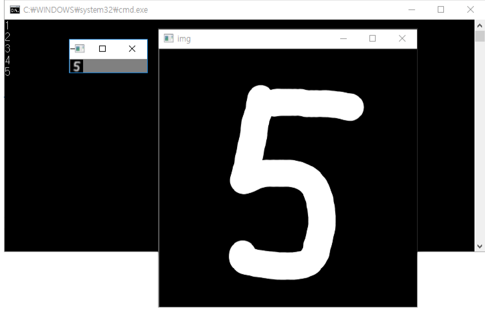

# Handprinted Numeral Recognition Program

Kyeongsoo Kim, March 2017 ~ June 2017

## Introduction
It's an academic project for getting familar With OpenCV library, and the concept of supervised machine learning (SVM, KNN), normalization, Histogram of Oriented Gradients (HOG).

## USAGE
> OpenCV must be installed to run the program.

Once you run the program, the program automatically train itself using KNN(knndigits file) or SVM + HOG(svmdigits file). You will write your handwritting at the most front panel, then cmd will tell you which number you write on.

